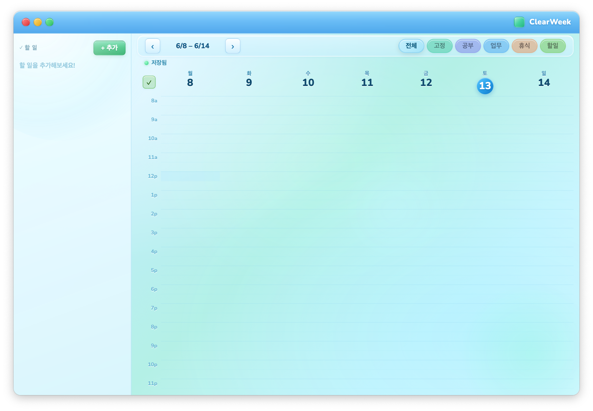

# ClearWeek

A minimal weekly time-block planner for macOS, built with Tauri.  
Designed with a Frutiger Aero-inspired aesthetic — translucent glass, soft gradients, and clean blue hues.



## Features

- Weekly grid (Mon–Sun, 08:00–24:00, 30-min slots)
- Drag-and-drop blocks with a resize handle
- 5 categories: Fixed / Study / Work / Break / Task
- Repeating weekly schedules (fixed events persist every week)
- Slide-out to-do panel — drag tasks directly onto the calendar
- Category filter
- Auto-save to localStorage (800 ms debounce)
- Frameless transparent window with a custom Aero-style titlebar

## Stack

- **Frontend** — Vanilla HTML / CSS / JS (single file, no build step)
- **Backend** — Rust + [Tauri v1](https://tauri.app)

## Getting Started

### Prerequisites

- [Rust](https://www.rust-lang.org/tools/install)
- [Node.js](https://nodejs.org)

```bash
# Xcode command line tools (macOS)
xcode-select --install

# Rust
curl --proto '=https' --tlsv1.2 -sSf https://sh.rustup.rs | sh
source ~/.cargo/env

# Dependencies
npm install
```

### Dev

```bash
npm run dev
```

The app window opens immediately. After editing `src/index.html`, reload with Cmd+R.

### Build

```bash
npm run build
```

Output:
- `src-tauri/target/release/bundle/macos/ClearWeek.app`
- `src-tauri/target/release/bundle/dmg/ClearWeek_1.0.0_x64.dmg`

Drag `ClearWeek.app` into `/Applications` to install.

### Icon (optional)

```bash
npx tauri icon your-icon-1024.png
```

## Data

Stored locally via `localStorage` at:  
`~/Library/WebKit/com.clearweek.app/`

No accounts, no network requests. Data persists across reinstalls.

## Roadmap

- **File-based persistence** — save data as a local JSON file via Tauri's file system API, so data survives a full browser cache wipe
- **iCloud / file sync** — optionally sync the data file through iCloud Drive for multi-device access
- **System tray** — live in the menu bar for quick access without a full window
- **Notifications** — native macOS alerts when a block is about to start
- **Google Calendar import** — pull in existing events to populate the grid automatically
- **Dark mode** — a deeper night-sky Aero palette for late-night sessions
- **Windows / Linux support** — Tauri is cross-platform; packaging and polish for other OSes
- **Export** — weekly summary as PDF or image for sharing

## License

MIT

---

# ClearWeek (한국어 설명)

Tauri로 만든 macOS용 주간 타임블록 플래너입니다.  
Frutiger Aero 감성(반투명 유리 UI, 부드러운 그라디언트, 청량한 블루톤)을 디자인 방향으로 삼아 개발되었습니다.

## 주요 기능

- 주간 그리드 (월~일, 08:00~24:00, 30분 단위)
- 블록 드래그 앤 드롭 + 하단 핸들로 길이 조절
- 카테고리 5종: 고정 / 공부 / 업무 / 휴식 / 할일
- 고정 일정은 매주 자동 반복
- 왼쪽 할 일 패널 — 항목을 캘린더로 드래그해서 바로 배치
- 카테고리 필터
- 자동 저장 (800ms 디바운스)
- 커스텀 타이틀바 + 프레임리스 투명 창

## 기술 스택

- **프론트엔드** — 바닐라 HTML / CSS / JS (단일 파일, 별도 빌드 없음)
- **백엔드** — Rust + [Tauri v1](https://tauri.app)

## 시작하기

### 준비물

- [Rust](https://www.rust-lang.org/tools/install)
- [Node.js](https://nodejs.org)

```bash
# Xcode 커맨드 라인 도구 (macOS)
xcode-select --install

# Rust 설치
curl --proto '=https' --tlsv1.2 -sSf https://sh.rustup.rs | sh
source ~/.cargo/env

# 패키지 설치
npm install
```

### 개발 실행

```bash
npm run dev
```

앱 창이 바로 뜹니다. `src/index.html`을 수정하고 Cmd+R로 새로고침하면 됩니다.

### 빌드

```bash
npm run build
```

결과물 경로:
- `src-tauri/target/release/bundle/macos/ClearWeek.app`
- `src-tauri/target/release/bundle/dmg/ClearWeek_1.0.0_x64.dmg`

`ClearWeek.app`을 `/Applications`에 드래그하면 설치 완료.

### 아이콘 교체 (선택)

```bash
npx tauri icon your-icon-1024.png
```

## 데이터

`localStorage`에 저장되며 macOS 기준 경로는 다음과 같습니다:  
`~/Library/WebKit/com.clearweek.app/`

로그인과 네트워크 요청이 없으며 앱을 재설치해도 데이터는 그대로 남습니다.

## 로드맵

- **파일 기반 저장** — Tauri 파일 시스템 API로 로컬 JSON에 저장, 브라우저 캐시가 날아가도 데이터 보존
- **iCloud 동기화** — iCloud Drive를 통해 여러 기기에서 같은 데이터 사용
- **시스템 트레이** — 메뉴바에 상주해서 창을 열지 않아도  빠르게 접근 가능한 시스템 구현
- **알림** — 블록 시작 전 macOS 네이티브 알림
- **Google Calendar 연동** — 기존 일정을 그리드로 바로 불러오기
- **다크 모드** — 심야 작업용 딥 나이트 Aero 팔레트
- **Windows / Linux 지원** — Tauri 크로스플랫폼 특성 활용
- **내보내기** — 주간 요약을 PDF나 이미지로 저장
- etc...

## 라이선스

MIT
